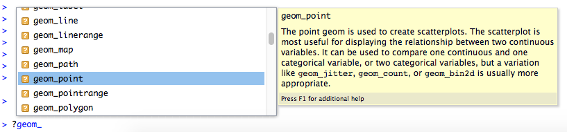
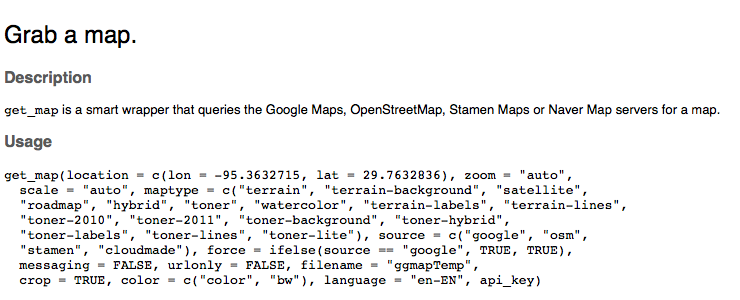
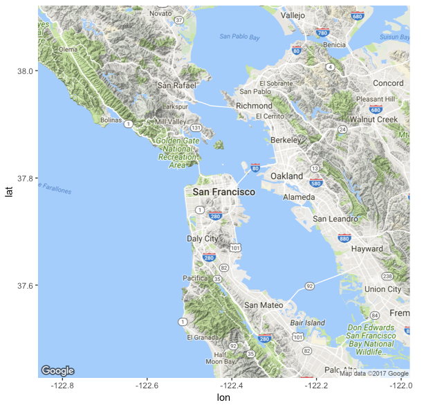

```{r setup, include=FALSE}
knitr::opts_chunk$set(echo = TRUE)
```

## Before we begin

1. Download the workshop files

2. Install any required libraries

## Creating Maps in R

Who are you?

Why are you here?


## R Packages for Mapping

There are a number of different R packages for working with geographic data and creating maps, including:

* [`sp`](https://cran.r-project.org/package=sp)
* [`ggplot2`](https://cran.r-project.org/package=ggplot2)
* [`ggmap`](https://cran.r-project.org/package=ggmap)
* [`tmap`](https://cran.r-project.org/package=tmap)
* [`leaflet`](https://cran.r-project.org/package=leaflet)

## R Base plots

You can also use the R base graphics function `plot()` to make quick plots by plotting longitude or x coordinates on the X axis and latitude or y coordinates on the Y axis. 

But it's quick & sometimes dirty, especially when your data covers a large geographic extent. Can you guess why?

## Don't plot geographic data like 2D data

Distances between degrees of longitude decrease with distance from the equator. 

So, plotting latitude and longitude across large areas on a 2D cartesian plot will distort distances and area.

## Mapping with ggplot2 and ggmap

This tutorial will show you how to create maps using the `ggplot2` and `ggmaps` packages.  

We will focus on point data.


## Why ggplot2

`gplot2` is perhaps the most widely used R package for plotting data. While not specifically for geographic data, you can use its expressive and powerful syntax to create beautiful maps. 

People who use ggplot can leverage that knowledge. However, newcomers to the package may find it non-intuitive.  Fortunately, there are many online tutorials and cheat-sheets for using ggplot. Some starting points are listed at the end of this tutorial.

## Why ggmap

`ggmap` extends ggplot2 with functionality for incorporating map data from popular online services like Google Maps data and OpenStreetMaps. It also has other functions for geocoding, computing distances and more. 

Use `?ggmap` to access the help page for ggmap and get the details on its functionality. 

A great article by the authors of ggmap, David Kahle and Hadley Wickham, that also serves as a tutorial, can be found here: https://journal.r-project.org/archive/2013-1/kahle-wickham.pdf.

## Questions?


## Geographic Data Fundamentals

Let's start with a brief review of geographic data fundamentals

## Geographic Data

Geographic data are observations about locations on or near the surface of the Earth. For example:

</img>

That tells you some useful information about this place but it doesn't tell you where it is on the surface of the Earth.

## Geospatial data

Geospatial data are geographic data that represent location geometrically with coordinates, such as latitude and longitude. 

These coordinates are referenced to specific locations on the Earth using a a coordinate reference system. 

</img>


## So Where is Anatone?

</img>

Can you tell which coordinate value is latitude and which one is longitude?

  `46.130479, -117.134167`

## Anatone, WA   

`46.130479, -117.134167`

Latitude is zero at the equator and decreases to -90 at the South Pole and increases to + 90 at the North pole.

Longitude is zero at the Prime Meridian (near London, England) and increases to -180 as you move west and to + 180 as you move east.

So, since latitude is never > 90 or less than < -90 the order must be latitude, longitude.


## Spatial Data

Spatial data is a more generic term that is not just for geographic data. 

Spatial data are powerful because software can dynamically determine spatial metrics like area and length, characteristics like distance and direction, and relationships like inside and intersects from these data.


## Mapping Airbnb Data for San Francisco

We will start by mapping some October AirBNB rental data that was downloaded from:
[Inside Airbnb](http://insideairbnb.com/get-the-data.html) on October 2, 2017.

These data are provided for instructional use only!

## First, load the data

We will look at two bedroom Airbnb rentals.

```{r data1}

# Set your working directory to the tutorial folder
setwd("~/Documents/Dlab/dlab_workshops/Maps_with_ggplot2_and_ggmap_tutorial")

# Load the data
sf_apts <- read.csv("data/sf_airbnb_2bds.csv")
```


## Take a look at the structure of the data

```{r data2}

str(sf_apts)

```


## And view some of the data values
```{r data3}
options(width = 80)

head(sf_apts[,1:4])
head(sf_apts[,5:9])
head(sf_apts[,10:13])

```

## Mapping with ggplot2 

Basic structure of a ggplot2 command begins with the call to the function `ggplot()`. 

In it's simplest form, a ggplot map requires:

- a data frame or other data object
- columns in the data frame with the x coordinate values and the y coordinate values
- a geometry type for rendering the data

## ggplot syntax

<blockquote>

ggplot(data=the_data_frame, aes(x = x_coord, y=y_coord)) + geom_point()

</blockquote>


<i>Note:argument names for `data=`, `x=` and `y=` are not required if they are provided in the order specificed by the function.</i>

## ggplot syntax

You can also use this syntax to create a map with ggplot:

- Note, when the data are in the geom_point() function the aesthetic mappings need to be first if the arguments are not named.

<blockquote>

ggplot() + geom_point(aes(x = x_coord, y=y_coord), data=the_data_frame)

</blockquote>

The benefit of this syntax is that it makes it easy to swap out ggmap() and ggplot() function calls.

It makes it easier to more map data with multiple geometry calls.

## Make your ggplot map

Use both syntaxes to create a simple map of sf_airbnb points.

- begin by loading the ggplot2 library
- try it with and with out the named arguments, eg `data=`

## Here's How

```{r map1, eval=FALSE}

library(ggplot2)

ggplot(data=sf_apts, aes(x=longitude, y=latitude)) + geom_point()

ggplot(sf_apts, aes(longitude, latitude)) + geom_point()

#

ggplot() + geom_point(data=sf_apts, aes(x=longitude, y=latitude))

ggplot() + geom_point(aes(longitude,latitude), sf_apts )

```


## What do you think of our first map? 

How might we improve it?

```{r map1b, eval=TRUE, echo=FALSE}
library(ggplot2)
ggplot() + geom_point(data=sf_apts, aes(longitude,latitude))

```


## `ggplot2` geometry types

ggplot2 can plot a number of geometry types. 

To see them all, enter `?geom_` and hit the tab key. Move your mouse down to get the short description of the geometry. 



## Getting Help 

View the help page by entering `?geom_point`.

Question: do any of the examples on the help page create a map of geographic data?


## Challenge - Style your map

Use the `geom_point` options to 

- change the point color to red 
- and the point size to 4
- and the opacity (alpha) to .0.25

**Notes** 

- These arguments do not go inside the `aes()` function unless they are mapped to a data column

- You can see some of the possible values in the help pages

- Or see the [Quick-R website's](http://www.statmethods.net/advgraphs/parameters.html) page for graphical parameters.

## Style - here's how

```{r map1c }

ggplot() + 
  geom_point(data=sf_apts, aes(longitude,latitude), 
             colour="red", size=4, alpha=0.25)

```

Does this style add any value?


## Remove the *Chart Junk*
```{r map1d, eval=FALSE}

ggplot() + 
  geom_point(data=sf_apts, aes(longitude,latitude), 
             colour="red", size=4, alpha=0.25) +
  theme_void() +                                        
  theme(plot.title = element_text(hjust = 0.5)) +       
  ggtitle("Airbnb 2 Bedroom Rentals, San Francisco")    

```

## Junk Free
```{r, eval=T, echo=F}

ggplot() + 
  geom_point(data=sf_apts, aes(longitude,latitude), 
             colour="red", size=4, alpha=0.25) +
  theme_void() +                                        
  theme(plot.title = element_text(hjust = 0.5)) +       
  ggtitle("Airbnb 2 Bedroom Rentals, San Francisco")    

```

## Adding Context with ggmap

Why? 

Let's use the `ggmap` package to add a **basemap** to our map. 

We will then display our Airbnb locations on top of the basemap.

A basemap is a reference map on top of which your primary map data is overlaid. 

- It should provide geographic context without obscuring content or theme.


## ggmap

First, load the library and take a look at the help page

```{r}
library(ggmap)

?ggmap
```

## get_map

You will see from the `ggmap` help page that the main function is `get_map`. Take a look at `?get_map` help page.

</img>


## A Simple ggmap

`get_map` allows you to retrieve map tiles from an online map service like Google Maps and use them in your map. Here are the steps:

1. Use `get_map()` with a location name or coordinates to fetch map tiles from an online service.
2. Use `ggmap()` to display the map.

Let's see what we get for San Francisco with the default settings.

```{r, eval=FALSE}
sfmap <- get_map(location="San Francisco")
ggmap(sfmap)
```

## Default ggmap

</img>

- What does the chatter from get_map indicate about the source of the map tiles?
- How well does the default map work for our Airbnb data? What can we improve?

## Adjusting the Zoom level

By default, ggmap automatically calculates a default zoom level based on your location and or data. As stated in the ggmap help page, zoom levels are integer values that range from 3 (continent) to 18 - 21 (local area) and the default setting is 10 (city).

> Set the `zoom=` parameter to a number that will give us an extent more appropriate for our Airbnb data.

## Here's How

```{r, eval=FALSE}

sfmap <- get_map(location="San Francisco", zoom=12)

ggmap(sfmap)

```


```{r, eval=TRUE, echo=FALSE}

sfmap <- get_map(location="San Francisco", zoom=12)

ggmap(sfmap)

```


## Combining ggplot and ggmap

Let's overlay the Airbnb points on the basemap. 

One way to do this is with the following syntax:

`ggmap(<your map object>) + geom_point(<your point data options>)`

For example:

`ggmap(sfmap) + geom_point(data=sf_apts, aes(longitude, latitude))`

**Try it!** 


## Here's How


```{r, eval=TRUE}

# Don't recreate the basemap if you haven't changed it!
# sfmap <- get_map(location="San Francisco", zoom=12)

ggmap(sfmap) + geom_point(data=sf_apts, aes(longitude, latitude)) 

```

## CHALLENGE

Redo the previous map with some of the symbology changes we made before:

- change the point color, size & opacity
- remove the axes labels
- Add a title


## Here's how

```{r, eval=TRUE}

# Don't recreate the basemap if you haven't changed it!
# sfmap <- get_map(location="San Francisco", zoom=12)

airbnb_map <- ggmap(sfmap) + geom_point(data=sf_apts, aes(longitude, latitude), 
                          colour="red", size=3, alpha=0.35) +
  theme_void() +
  theme(plot.title = element_text(hjust = 0.5)) +
  ggtitle("Airbnb 2 Bedroom Rentals, San Francisco")

```

## Show it
```{r}

airbnb_map

```

## CHALLENGE

Change the basemap to stamen toner. See `?get_map` for help.

*Hint: you need to add two arguments in the get_map() function*

## Here's How

```{r, eval=TRUE}

# Don't recreate the basemap if you haven't changed it!
sfmap <- get_map(location="San Francisco", zoom=12, 
                 source = "stamen", maptype="toner")

mymap<- ggmap(sfmap) + geom_point(data=sf_apts, aes(longitude, latitude), colour="red", size=3, alpha=0.35) +
  theme_void() +
  theme(plot.title = element_text(hjust = 0.5)) +
  ggtitle("Airbnb 2 Bedroom Rentals, San Francisco")

```

## 

```{r}

mymap

```

## Adding another data point

We can overlay one or more geometries on top of our map by chaining geometry functions like `+geom_point(...)`

Let's add a point for the civic center and label it "Civic Center". 

- Get the point coordinates by right-clicking on the location in Google Maps.
- Remember that coordinate order matters!
- Add the point using `+geom_point(aes(x,y), size=5, color="black")`
- Bonus: add a label using `+geom_text`
- Work with a neighbor / Ask for a hint if you need one!

## Here's How to add a labeled point

```{r, eval=TRUE}

mymap <- ggmap(sfmap) + 
  geom_point(data=sf_apts, aes(longitude, latitude), colour="red", 
             size=4, alpha=0.35) +
  geom_point(aes(-122.419900, 37.776154), size=5, shape=15) +
  geom_text(aes(-122.419900, 37.776154 - 0.01), label = "Civic Center") +   
  theme_void() +
  theme(plot.title = element_text(hjust = 0.5)) +
  ggtitle("Airbnb 2 Bedroom Rentals, San Francisco")

```

## Map it

```{r, echo=F}

mymap

```


## Data Maps

## Data Maps
Data driven maps use data values to determine map symbology. 

For example, we can set the color of the points by the values in one of the columns of our sf_apts data frame.

What attributes of the airbnb rentals do you think might be interesting to map?


## Mapping Categorical Data

We can map categories by color by moving the color parameter inside the `aes()` and setting the value to a column name.

For example:

`ggmap(sfmap) + 
    geom_point(data=sf_apts, aes(longitude, latitude, colour=property_type, size=2, alpha=1)`

**Try it!**

## Airbnb Rentals by Property Type

```{r, eval=TRUE}
ggmap(sfmap) + 
  geom_point(data=sf_apts, aes(longitude, latitude, colour=property_type), 
             size=2, alpha=1)
```

## Faceting with GGMap

Alternatively, you can create a map for each category by faceting the data.

This works best if you column has few unique categories.

Note, you must use the `baselayer` parameter with ggmap to add facets!

## Here's How
```{r, eval=TRUE}

mymap <- ggmap(sfmap, 
  base_layer=ggplot(data=sf_apts, aes(longitude, latitude))) +
  geom_point(col="red",size=1, alpha=1) +
  facet_wrap(~property_type)
```

##
```{r}
mymap
```

## Mapping Quantitative Data

For numerical data we can set the map symbology based on the data values.

We can vary color or size by the data values.

Let's try that with the rental `price` data.

It's a good idea to take a look at the distribution of the data values before mapping.

## Price - histogram

```{r}

hist(sf_apts$price)

```

## Mapping a subset

It seems as though most of the 2 bedroom rentals are below $1,000 (per day). 

Let's subset the data to reduce the impact of outliers on our maps (this is one approach).

```{r}
sf_apts1k <- sf_apts[sf_apts$price < 1000,]

mymap <- ggmap(sfmap) +
  geom_point(data=sf_apts1k, aes(x=longitude, y=latitude, color=price))
```

## 

```{r}
mymap
```

## Zoom in On the data

Our zoom level is a bit too low (12) to see our data well. Let's zoom in to level 13 and recenter the map on our data.

See if you can follow along with the code below - what's it doing?

```{r}
sfmap13 <- get_map(location=c(mean(sf_apts1k$longitude), 
                mean(sf_apts1k$latitude)), zoom=13, 
                source = "stamen", maptype="toner")

```

## View the map

Does the new zoom level improve the map?
```{r}
ggmap(sfmap13) +
  geom_point(data=sf_apts1k, aes(x=longitude, y=latitude, color=price))
```


## View the map with all data

We can make a custom map extent by identifying the bounding box of our data.

First, we identify the bounding box from the min/max lat and lon values

Then, we use those to create a new basemap.
```{r}
bbox <- c(min(sf_apts1k$longitude), min(sf_apts1k$latitude), 
          max(sf_apts1k$longitude), max(sf_apts1k$latitude))

sfmap_bbox <- get_map(location = bbox, source = "stamen",
                      maptype = "toner-lite")

```

## Use custom basemap

```{r}
ggmap(sfmap_bbox) +
  geom_point(data=sf_apts1k, aes(x=longitude, y=latitude, color=price))
```

## The Art of Cartography

Because my points are many and small and my colors are all in a narrow range of blues, it's hard to take much away from this map about the rental prices.

Let's see if a different color scheme can improve the map.

## rColorBrewer Package

The R package `RColorBrewer` is often used to select color palettes. Read the package help for more info.

You can use the `display.brewer` function to see the colors in a specific named palette.

For example:

```{r }
library(RColorBrewer)
# ?ColorBrewer # access help pages
display.brewer.pal(5,"Set3") # qualitative color palette with 5 colors
```

## Types of Color Palettes:

- **Qualitative** - complementary colors, e.g. pastels, to emphasize different categories

- **Sequential** - a range of different shades of the same color (hue) to imply higher to lower ranks or values

- **Divergent** - two squential color palettes with a light or grey color in the middle; used to emphasize outliers

## Nobody said this was easy!

</a>

## Displaying Color Palettes by Type

```{r, eval=FALSE}
display.brewer.all(type="qual")
display.brewer.all(type="seq")
display.brewer.all(type="div")
```


## Applying a Color Palette

Let's see how a `YlOrRd` palette works with this data.

Here we use `scale_fill_distiller` to map the data to to colors.

```{r}
mymap <- ggmap(sfmap_bbox) +
  geom_point(data=sf_apts1k, aes(x=longitude, y=latitude, color=price)) +
    scale_color_distiller(palette="YlOrRd", direction=1)

# ?scale_color_distiller
# The distiller scales extends brewer to continuous scales by smoothly interpolate 6 colours 
#from any palette to a continuous scale.

```

##

```{r}
mymap
```

## Order matters!

When you are mapping a lot of overlapping points you can think about what you would like to highlight in the map, for example low versus high data values.

You data will display on the map in the order it appears in the data frame. So if you want all the high value points to display on top you can sort the data values ascending. Try it with this data and recreate the previos map.

```{r}
# sort data frame by price
sf_apts1k <- sf_apts1k[order(sf_apts1k$price),] 

mymap <- ggmap(sfmap_bbox) +
  geom_point(data=sf_apts1k, aes(x=longitude, y=latitude, color=price)) +
    scale_color_distiller(palette="YlOrRd", direction=1)
```

##

```{r}
mymap
```

## Data classification

Another extremely important method for improving the cartographic display of continuous data is data classification. While unclassified maps are great for exploring trends and outliers, they make it very hard to interpret specific data values.

You can use a data classification method to reduce the complexity in your mapped data by classifying continuous values into N (typically 5) bins. Common methods include:

- `equal interval`: classes the data into bins of equal data ranges, e.g. 10-20, 20-30, 30-40.

- `quantile`: classes the data into bins with an equal number of data observations. This is the default for most mapping software.

- `jenks/natural breaks`: classes data into bins that minmizie within group variance and maximize between group variance.


##  Data Classification 

There are many ways to do this in R and with `ggplot` and `ggpmap`. We show one below that applies the `scale_color_distiller` function to the ggmap object. Read the function documentation for more information.

```{r}
library(classInt)

mymap <- ggmap(sfmap_bbox) +
  geom_point(data=sf_apts1k, aes(x=longitude, y=latitude, color=price), size=2, alpha=1) +
  scale_color_distiller(name="price",palette = "Spectral", breaks = classIntervals(sf_apts1k$price, n=6, style="quantile")$brks  )
```

##

```{r}
mymap
```


## Challenge

Recreate the previous map using the *equal interval* and *Jenks* classification methods. 

To do this set the `style=` argument in the `scale_color_distiller` function to *equal* or *jenks*, respectively.

**Bonus**: set the `guide=` argument to get a legend instead of a colorbar.


## Mapping Geograhic Data

Thus, far we have worked with **point** data. 

Other common types of geospatial data include **lines**, **polygons** and **grids**.

Points, lines and polygons are classified as **Vector Data** while grid cells are **Raster Data**

Vector data maps with points and polygons are quite common, with line data less so.

Raster data maps are often used to create density maps, called heat maps, or surface maps.

## Mapping Polygon Data

Let's map some polygon data from the **maps** package.

First, load the library and the data in it.

```{r}
library(maps)

# what data are in the package?
data(package="maps")

# more info
?map_data
```

## Load the States data

and take a look at it
```{r}
states <- map_data("state")  #  See ?map_data for details
head(states)
```

## Basic format for ggplot Polygon data frame

- **long** column with X coord values as a numeric data type
- **lat** column of Y coord values
- **group** identifies a set of points. One lat/long pair is a point, points with the same group can be connected as a path/line or polygon. For example each island in the United Kingdom is a group.
- **order** tells us the order with which to connect the points (think connect-the-dots) for a group.
- **region** and subregion identify named features. For example, in the world data frame all island groups within the United Kingdom have the region value "UK" and "Scotland" is one subregion.

## Plot the States

What geom_* type would you use?

## Plot the States - try 1

```{r}
ggplot(states, aes(x=long, y=lat)) +
  geom_polygon()
```

## Plot the States - try 2

```{r}
ggplot(states, aes(x=long, y=lat)) +
  geom_polygon(aes(group=group))
```

## Plot the States - try 3

```{r}
ggplot(states, aes(x=long, y=lat)) +
  geom_polygon(aes(group=group), color="red", fill="blue")
```

## Challenge

Create some plots of the states

- change the fill and outline colors

- set an alpha value for the fill opacity


## Save a basic map 

```{r}
usmap <- ggplot(states, aes(x=long, y=lat)) +
  geom_polygon(aes(group=group), color="black", fill="white")
```

## How does it look?

```{r}
usmap
```

## Map Projections

The world isn't flat.

When you plot geographic coordinates in 2D you get distortion.

A **map projection**is a mathematical model that transforms geo coordinates to 2D.  

This process introduces distortion.

## Explore the impact of different Map Projection

Try these commands
```{r, eval=FALSE}
?coord_map
usmap # Use cartesian coordinates
usmap + coord_map() # With mercator projection
usmap + coord_map("orthographic")
usmap + coord_map("polyconic")
```

## Choropleth Mapping

Map areas by data values

Also called thematic maps or data maps

Sometimes called heat maps

## Category Maps

```{r}
ggplot(states, aes(x=long, y=lat)) +
  geom_polygon(aes(group=group, fill=region), color="white")
```

## Challenge

Add a coord_map()

Set the theme to void

## Here's how

```{r}
ggplot(states, aes(x=long, y=lat)) +
  geom_polygon(aes(group=group, fill=region), color="white") +
  coord_map("polyconic") +
  theme_void()
```

## State Attribute Data
The state data includes a matrix called *state.x77* that has key variables for each state. Let's take a look.

```{r, eval=FALSE}
data(state)
state_att <- state.x77     # rename it

head(state_att)
head(states) 
```

## Merge data frames by common values

```{r, eval=FALSE}
unique(states$region)
unique(row.names(state_att))   # Alaska/DC not in both data sets, but it's okay. why?
                               # tolower state names
#convert to a data frame
state_att <- as.data.frame(state_att[-which(row.names(state_att)=="Alaska"),])  
# not necessary. why?

```

##
```{r, eval=FALSE}
state_att$name <- tolower(row.names(state_att)) # why is this necessary?

states_dat <- merge(states, state_att, by.x="region", by.y="name")

head(state_dat)
``` 

## Map by Pop

```{r, eval=FALSE}
ggplot(states_dat, aes(x=long, y=lat)) +
  geom_polygon(aes(group=group, fill=Population), colour="black") +
  coord_map("polyconic")
```

## Challenge

Take a look at the **?scale_fill_distiller** help page. Try changing some of the options, eg add *palette="Reds" inside scale_fill_distiller().


## Here's One Way

```{r, eval=FALSE}
ggplot(states_dat, aes(x=long, y=lat)) +
  geom_polygon(aes(group=group, fill=Population), colour="NA") +
  scale_fill_distiller(palette = "Reds") +
  coord_map("mercator") +
  labs(title = "Population by State") +
  theme_nothing(legend=TRUE) +
  guides(fill = guide_legend(reverse = TRUE))
```

## Challenge

Display the population data using ggmap
on top of a basemap of the continental USA

## Saving your maps

?ggsave

## Questions?
